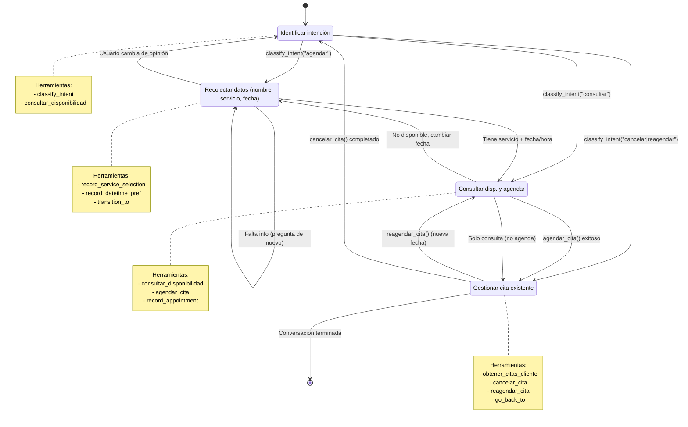

# 📋 Diseño Detallado: State Machine para Arcadium (Fase 0)

**Fecha:** 2026-04-03  
**Autor:** Claude Code (análisis) + jav (revisión)  
**Estado:** ✅ **Diseño aprobado - Listo para implementación**

---

## 🎯 **Visión General**

Transformar `DeyyAgent` de un agente con herramientas estáticas a un **State Machine** donde:

1. **Cada estado tiene su propio prompt + herramientas**
2. **Las tools controlan las transiciones** actualizando `current_step`
3. **El estado persiste** entre turnos vía `MemoryManager`
4. **El workflow es guiado** por el agente según su progreso

---

## 🔄 **Diagrama de Estados de Citas Dentales**



---

## 📊 **Tabla de Estados**

| Estado           | Propósito                                | Herramientas Disponibles                                                       | Datos que Recolecta                                     | Transiciones a                                                                       |
| ---------------- | ---------------------------------------- | ------------------------------------------------------------------------------ | ------------------------------------------------------- | ------------------------------------------------------------------------------------ |
| **RECEPCIÓN**    | Identificar qué quiere el usuario        | `classify_intent`, `consultar_disponibilidad`, `transition_to`                 | `intent`                                                | AGENDAR → INFORMACIÓN<br>CONSULTAR → COORDINACIÓN<br>CANCELAR/REAGENDAR → RESOLUCIÓN |
| **INFORMACIÓN**  | Recolectar: nombre, servicio, fecha/hora | `record_service_selection`, `record_datetime_pref`, `transition_to`            | `patient_name`, `selected_service`, `selected_datetime` | Completo → COORDINACIÓN<br>Incompleto → INFORMACIÓN<br>Cambio → RECEPCIÓN            |
| **COORDINACIÓN** | Consultar disponibilidad y agendar       | `consultar_disponibilidad`, `agendar_cita`, `record_appointment`, `go_back_to` | `appointment_id`, `google_event_id`                     | Agendado → RESOLUCIÓN<br>No disponible → INFORMACIÓN<br>Solo consulta → RESOLUCIÓN   |
| **RESOLUCIÓN**   | Gestionar cita ya agendada               | `obtener_citas_cliente`, `cancelar_cita`, `reagendar_cita`, `go_back_to`       | N/A (lee de DB)                                         | Cancelar → RECEPCIÓN<br>Reagendar → INFORMACIÓN<br>Finalizar → [*]                   |

---

## 🧱 **SupportState - Schema Completo**

```python
from typing import Literal, NotRequired, Optional
from langchain.agents import AgentState
from typing_extensions import TypedDict

# === Enums ===
SupportStep = Literal[
    "reception",           # Paso 1: Identificación
    "info_collector",      # Paso 2: Recolección de datos
    "scheduler",           # Paso 3: Consulta/Agendado
    "resolution"           # Paso 4: gestión posterior
]

Intent = Literal[
    "agendar",            # Quiere agendar nueva cita
    "consultar",          # Solo quiere ver disponibilidad
    "cancelar",           # Quiere cancelar cita existente
    "reagendar",          # Quiere cambiar fecha/hora
    "otro"                # Otro motivo
]

ServiceType = Literal[
    "consulta",           # Consulta dental (30 min)
    "limpieza",           # Limpieza dental (45 min)
    "empaste",            # Empaste/res filling (45 min)
    "extraccion",         # Extracción dental (45 min)
    "endodoncia",         # Conducto (60-90 min)
    "ortodoncia",         # Ortodoncia (60 min)
    "cirugia",            # Cirugía (60-90 min)
    "implantes",          # Implante dental (90 min)
    "estetica",           # Estética dental (60 min)
    "odontopediatria"     # Niños (30-45 min)
]

# === Schema ===
class SupportState(AgentState):
    """
    Estado completo de la state machine de agendamiento.
    Cada campo se va poblando según avanza el workflow.
    """

    # === Campo REQUERIDO (controla flujo) ===
    current_step: NotRequired[SupportStep]

    # === Campos de RECEPCIÓN ===
    intent: NotRequired[Intent]  # Intención detectada

    # === Campos de INFORMACIÓN ===
    patient_name: NotRequired[str]           # Nombre del paciente
    patient_phone: NotRequired[str]         # Teléfono (opcional, por si no es el mismo)
    selected_service: NotRequired[ServiceType]  # Servicio dental
    service_duration: NotRequired[int]      # Duración en minutos (30, 45, 60, 90)
    datetime_preference: NotRequired[str]   # Fecha/hora preferida (ISO)
    datetime_alternatives: NotRequired[List[str]]  # Alternativas si no disponible

    # === Campos de COORDINACIÓN ===
    availability_checked: NotRequired[bool]  # Ya consultó disponibilidad
    available_slots: NotRequired[List[str]]  # Lista de slots libres encontrados
    selected_slot: NotRequired[str]         # Slot elegido por usuario
    appointment_id: NotRequired[str]        # UUID de cita en DB
    google_event_id: NotRequired[str]       # ID evento en Google Calendar
    google_event_link: NotRequired[str]     # Enlace al evento

    # === Campos de RESOLUCIÓN ===
    confirmation_sent: NotRequired[bool]    # Confirmación enviada
    appointment_details: NotRequired[Dict]  # Detalles completos de la cita
    follow_up_needed: NotRequired[bool]     # Requiere seguimiento

    # === Metadata ===
    conversation_turns: NotRequired[int]    # Número de turnos en este flujo
    last_tool_used: NotRequired[str]        # Última herramienta ejecutada
    errors_encountered: NotRequired[List[str]]  # Errores recuperables
```

---

## 🛠️ **Herramientas con Command**

### 1. **classify_intent** - Clasifica intención del usuario

```python
@tool
def classify_intent(
    user_message: str,
    runtime: ToolRuntime[None, SupportState]
) -> Command:
    """
    Analiza el mensaje del usuario y clasifica su intención.

    Categorías:
    - "agendar": Quiere reservar nueva cita
    - "consultar": Solo quiere ver disponibilidad
    - "cancelar": Quiere eliminar cita existente
    - "reagendar": Quiere modificar fecha/hora
    - "otro": Otro motivo

    Returns:
        Command que actualiza 'intent' y transita a paso siguiente
    """
    # LLM determina intención con Few-shot prompting
    intent = detect_intent_with_llm(user_message)

    # Determinar siguiente estado basado en intención
    next_step = {
        "agendar": "info_collector",
        "consultar": "scheduler",
        "cancelar": "resolution",
        "reagendar": "resolution",
        "otro": "reception"  # Mantener en recepción si no entendió
    }[intent]

    return Command(
        update={
            "messages": [ToolMessage(
                content=f"Intención detectada: {intent}",
                tool_call_id=runtime.tool_call_id
            )],
            "intent": intent,
            "current_step": next_step
        }
    )
```

**Ejemplo:**

```
User: "Hola, quiero una limpieza dental"
→ classify_intent() detecta "agendar"
→ current_step = "info_collector"
```

---

### 2. **record_service_selection** - Registra servicio dental

```python
@tool
def record_service_selection(
    service: str,  # "limpieza", "consulta", etc.
    runtime: ToolRuntime[None, SupportState]
) -> Command:
    """
    Registra el servicio dental seleccionado y su duración.
    No transita - solo guarda dato. Sigue en info_collector.
    """
    duration = get_duration_for_service(service)  # 30, 45, 60, 90

    return Command(
        update={
            "messages": [ToolMessage(
                content=f"Servicio: {service} ({duration} min)",
                tool_call_id=runtime.tool_call_id
            )],
            "selected_service": service,
            "service_duration": duration
        }
    )
```

**Uso:** El agente llama a esta tool cuando identifica el servicio, pero **no transita** hasta tener también la fecha.

---

### 3. **record_datetime_pref** - Registra fecha/hora preferida

```python
@tool
def record_datetime_pref(
    fecha: str,  # ISO: "2025-12-25T14:30"
    alternatives: Optional[List[str]] = None,
    runtime: ToolRuntime[None, SupportState]
) -> Command:
    """
    Registra la fecha/hora preferida del usuario.

    Args:
        fecha: Fecha principal en formato ISO
        alternatives: Lista de fechas alternativas (opcional)

    Returns:
        Command que guarda fecha y transita a 'scheduler'
    """
    return Command(
        update={
            "messages": [ToolMessage(
                content=f"Fecha preferida: {fecha}",
                tool_call_id=runtime.tool_call_id
            )],
            "datetime_preference": fecha,
            "datetime_alternatives": alternatives or [],
            "current_step": "scheduler"  # ← Transita a coordinación
        }
    )
```

**NOTA:** Esta tool SÍ transita porque tener fecha es suficiente para pasar a coordinar (aunque no haya servicio aún, se puede consultar disponibilidad genérica).

---

### 4. **consultar_disponibilidad** - Consulta slots libres

```python
@tool
async def consultar_disponibilidad(
    fecha: Optional[str] = None,  # Si None, usa datetime_preference del state
    servicio: Optional[str] = None,  # Si None, usa selected_service del state
    runtime: ToolRuntime[None, SupportState]
) -> Dict[str, Any]:
    """
    Consulta horarios disponibles para agendar.

    Fuentes:
    1. Google Calendar (si habilitado)
    2. Base de datos (citas ya agendadas)

    Devuelve lista de slots ordenados.
    """
    # Obtener estado actual
    state = runtime.state
    fecha = fecha or state.get("datetime_preference")
    servicio = servicio or state.get("selected_service")

    # Usar AppointmentService existente
    slots = await appointment_service.get_available_slots(
        date=fecha.split("T")[0],  # Solo fecha
        duration=get_duration_for_service(servicio) if servicio else 30
    )

    # Actualizar state con slots encontrados (sin transitar)
    return Command(
        update={
            "messages": [ToolMessage(
                content=f"Disponibilidad consultada: {len(slots)} slots",
                tool_call_id=runtime.tool_call_id
            )],
            "available_slots": [slot.isoformat() for slot in slots],
            "availability_checked": True
        }
    )
```

**Importante:** Esta tool NO transita. El agente debe decidir si elige un slot y agenda, o pide otra fecha.

---

### 5. **agendar_cita** - Crea nueva cita

```python
@tool
async def agendar_cita(
    fecha: Optional[str] = None,  # Si None, usa selected_slot del state
    servicio: Optional[str] = None,
    notas: Optional[str] = None,
    runtime: ToolRuntime[None, SupportState]
) -> Command:
    """
    Agenda la cita en Google Calendar + DB.

    Flujo:
    1. Valida fecha (futura, laboral)
    2. Consulta disponibilidad (otra vez para race condition)
    3. Crea evento en Google Calendar
    4. Guarda en PostgreSQL
    5. Devuelve confirmación + enlace

    Returns:
        Command con appointment_id y transita a 'resolution'
    """
    state = runtime.state
    fecha = fecha or state.get("selected_slot") or state.get("datetime_preference")
    servicio = servicio or state.get("selected_service")
    phone = get_current_phone()

    # Crear cita (usa AppointmentService existente)
    success, message, appointment = await appointment_service.create_appointment(
        session=get_async_session(),
        phone_number=phone,
        appointment_datetime=datetime.fromisoformat(fecha),
        service_type=servicio,
        notes=notas
    )

    if success and appointment:
        return Command(
            update={
                "messages": [ToolMessage(
                    content=f"Cita agendada: {appointment.id}",
                    tool_call_id=runtime.tool_call_id
                )],
                "appointment_id": str(appointment.id),
                "google_event_id": appointment.google_event_id,
                "google_event_link": appointment.google_event_link,
                "current_step": "resolution"  # ← ÉXITO: Transita a resolución
            }
        )
    else:
        # Falló - no transita, permanece en scheduler
        return Command(
            update={
                "messages": [ToolMessage(
                    content=f"Error agendando: {message}",
                    tool_call_id=runtime.tool_call_id
                )],
                "errors_encountered": state.get("errors_encountered", []) + [message]
            }
        )
```

---

### 6. **record_appointment** - Registra cita ya agendada (helper)

```python
@tool
def record_appointment(
    appointment_id: str,
    google_event_link: Optional[str] = None,
    runtime: ToolRuntime[None, SupportState]
) -> Command:
    """
    Helper: registra datos de cita agendada y transita a resolution.
    Se usa después de agendar (ya sea por esta tool o por agendar_cita).
    """
    return Command(
        update={
            "messages": [ToolMessage(
                content=f"Appointment recorded: {appointment_id}",
                tool_call_id=runtime.tool_call_id
            )],
            "appointment_id": appointment_id,
            "google_event_link": google_event_link,
            "current_step": "resolution"
        }
    )
```

**Nota:** Redundante con `agendar_cita` que ya hace `record_appointment`. Útil si el agente quiere separar pasos.

---

### 7. **obtener_citas_cliente** - Busca citas del usuario

```python
@tool
async def obtener_citas_cliente(
    historico: bool = False,
    runtime: ToolRuntime[None, SupportState]
) -> Dict[str, Any]:
    """
    Obtiene las citas del cliente actual (del phone_number en context).

    Args:
        historico: Si True, incluye citas pasadas/canceladas

    Returns:
        Dict con lista de citas (NO transita)
    """
    phone = get_current_phone()

    # Usar AppointmentService existente
    citas = await appointment_service.get_appointments_by_phone(
        phone=phone,
        include_past=historico
    )

    return {
        "citas": [
            {
                "id": c.id,
                "fecha": c.datetime.isoformat(),
                "servicio": c.service_type,
                "estado": c.status,
                "google_link": c.google_event_link
            }
            for c in citas
        ],
        "count": len(citas)
    }
```

**Uso:** En RESOLUCIÓN, el agente usa esta tool para mostrar al usuario sus citas existentes antes de decidir cancelar/reagendar.

---

### 8. **cancelar_cita** - Cancela una cita

```python
@tool
async def cancelar_cita(
    appointment_id: Optional[str] = None,
    runtime: ToolRuntime[None, SupportState]
) -> Command:
    """
    Cancela una cita agendada.

    Flujo:
    1. Si no hay appointment_id, busca la próxima cita del cliente
    2. Elimina evento de Google Calendar (si existe)
    3. Actualiza estado en DB a "cancelled"
    4. Transita a 'reception' (reinicia workflow)

    Returns:
        Command con confirmación y transición a reception
    """
    phone = get_current_phone()

    if not appointment_id:
        # Buscar próxima cita
        citas = await appointment_service.get_appointments_by_phone(
            phone=phone,
            include_past=False
        )
        if not citas:
            return Command(update={
                "messages": [ToolMessage(
                    content="No hay citas para cancelar",
                    tool_call_id=runtime.tool_call_id
                )]
            })
        appointment_id = citas[0].id

    # Ejecutar cancelación
    success, message = await appointment_service.cancel_appointment(
        appointment_id=uuid.UUID(appointment_id) if isinstance(appointment_id, str) else appointment_id,
        phone=phone
    )

    if success:
        return Command(
            update={
                "messages": [ToolMessage(
                    content=f"Cita cancelada: {appointment_id}",
                    tool_call_id=runtime.tool_call_id
                )],
                "appointment_id": None,
                "current_step": "reception"  # ← Cancelación complete: volver a inicio
            }
        )
    else:
        return Command(update={
            "messages": [ToolMessage(
                content=f"Error cancelando: {message}",
                tool_call_id=runtime.tool_call_id
            )],
            "errors_encountered": runtime.state.get("errors_encountered", []) + [message]
        })
```

---

### 9. **reagendar_cita** - Reagenda a nueva fecha

```python
@tool
async def reagendar_cita(
    appointment_id: Optional[str] = None,
    nueva_fecha: Optional[str] = None,
    runtime: ToolRuntime[None, SupportState]
) -> Command:
    """
    Cambia fecha/hora de una cita existente.

    Flujo:
    1. Si no hay appointment_id, usa la próxima cita del cliente
    2. Consulta disponibilidad en nueva_fecha
    3. Si disponible: actualiza Google Calendar + DB
    4. Transita a 'info_collector' para recolectar nueva info si es necesaria

    Returns:
        Command con resultado y transición
    """
    phone = get_current_phone()
    state = runtime.state

    # Determinar qué cita reagendar
    if not appointment_id:
        # Buscar próxima cita
        citas = await appointment_service.get_appointments_by_phone(
            phone=phone,
            include_past=False
        )
        if not citas:
            return Command(update={
                "messages": [ToolMessage(
                    content="No hay citas para reagendar",
                    tool_call_id=runtime.tool_call_id
                )]
            })
        appointment_id = citas[0].id

    # Si no pasó nueva_fecha, extraer de state (datetime_preference o selected_slot)
    if not nueva_fecha:
        nueva_fecha = state.get("selected_slot") or state.get("datetime_preference")
        if not nueva_fecha:
            return Command(update={
                "messages": [ToolMessage(
                    content="Necesito una nueva fecha para reagendar",
                    tool_call_id=runtime.tool_call_id
                )]
            })

    # Ejecutar reagendado
    success, message, updated_appointment = await appointment_service.reschedule_appointment(
        appointment_id=uuid.UUID(appointment_id) if isinstance(appointment_id, str) else appointment_id,
        new_datetime=datetime.fromisoformat(nueva_fecha),
        phone=phone
    )

    if success:
        return Command(
            update={
                "messages": [ToolMessage(
                    content=f"Cita reagendada a {nueva_fecha}",
                    tool_call_id=runtime.tool_call_id
                )],
                "appointment_id": str(updated_appointment.id),
                "selected_date": nueva_fecha,
                "google_event_link": updated_appointment.google_event_link,
                "current_step": "info_collector"  # ← Volver a recoger datos (por si quiere agendar más)
            }
        )
    else:
        return Command(update={
            "messages": [ToolMessage(
                content=f"Error reagendando: {message}",
                tool_call_id=runtime.tool_call_id
            )],
            "errors_encountered": state.get("errors_encountered", []) + [message]
        })
```

---

### 10. **transition_to** - Transición genérica (controlada por agente)

```python
@tool
def transition_to(
    step: SupportStep,
    reason: str,
    runtime: ToolRuntime[None, SupportState]
) -> Command:
    """
    Transita manualmente a un estado específico.

    ADVERTENCIA: Solo usar si el workflow requiere saltar no estándar.
    Normalmente las tools específicas manejan las transiciones.

    Args:
        step: Estado destino (reception|info_collector|scheduler|resolution)
        reason: Razón de la transición (para logs)

    Returns:
        Command que actualiza current_step
    """
    logger.info(
        "State transition (manual)",
        from_step=runtime.state.get("current_step"),
        to_step=step,
        reason=reason,
        session_id=runtime.state.get("session_id")
    )

    return Command(update={"current_step": step})
```

---

### 11. **go_back_to** - Retroceder a estado anterior

```python
@tool
def go_back_to(
    step: Literal["reception", "info_collector", "scheduler"],
    reason: str,
    runtime: ToolRuntime[None, SupportState]
) -> Command:
    """
    Retrocede a un estado anterior para corrección.

    Casos de uso:
    - Usuario dice "en realidad mi nombre es..."
    - Usuario quiere otra fecha
    - Cancelar agendado y empezar de nuevo

    NOTA: No se puede volver de 'resolution' a 'scheduler' directamente
    (iría primero a info_collector)
    """
    return Command(update={"current_step": step})
```

---

## 📝 **Configuración por Estado (STEP_CONFIGS)**

```python
from langchain_core.prompts import ChatPromptTemplate

# === PROMPT 1: RECEPCIÓN ===
RECEPTION_PROMPT = """Eres Deyy, asistente especializado en gestión de citas dentales.

ESTADO ACTUAL: **RECEPCIÓN** (Identificación de intención)

OBJETIVO:
Determinar qué desea hacer el usuario y clasificar su intención.

FLUJO:
1. Saluda cordialmente si es primer turno
2. Pregunta: "¿En qué puedo ayudarte?" o similar
3. Escucha respuesta del usuario
4. Usa la herramienta `classify_intent` para categorizar:
   - "agendar" → quiero reservar nueva cita
   - "consultar" → solo ver disponibilidad
   - "cancelar" → eliminar cita existente
   - "reagendar" → cambiar fecha/hora
   - "otro" → necesita otra ayuda

HERRAMIENTAS DISPONIBLES:
{tool_names}

INSTRUCCIONES IMPORTANTES:
- NO asumas la intención - usa classify_intent EXPLÍCITAMENTE
- Si el usuario menciona "agendar", "cita", "reservar" → classify_intent("agendar")
- Si el usuario pregunta "¿hay hueco?", "disponibilidad" → classify_intent("consultar")
- Si el usuario dice "cancelar", "eliminar", "anular" → classify_intent("cancelar")
- Si el usuario dice "cambiar", "mover", "reagendar" → classify_intent("reagendar")
- Si no estás seguro → classify_intent("otro")

Una vez clasificada la intención, la transición al siguiente estado es automática.
"""

# === PROMPT 2: INFORMACIÓN ===
INFO_COLLECTOR_PROMPT = """Eres Deyy, asistente de gestión de citas dentales.

ESTADO ACTUAL: **INFORMACIÓN** (Recolección de datos)

CONTEXTO:
Intención detectada: {intent}

DATOS FALTANTES (revisa el estado actual):
- Nombre del paciente: {patient_name}
- Servicio dental: {selected_service}
- Fecha/hora preferida: {datetime_preference}

FLUJO:
1. Revisa qué datos ya están en el estado
2. Pregunta SOLO por la información faltante (uno a uno)
3. Cuando el usuario proporcione dato, usa la herramienta correspondiente:
   - Servicio → record_service_selection(servicio="limpieza")
   - Fecha → record_datetime_pref(fecha="2025-12-25T14:30")
4. Cuando tengas SERVICIO y FECHA, el agente transitará automáticamente a COORDINACIÓN

HERRAMIENTAS DISPONIBLES:
{tool_names}

INSTRUCCIONES:
- NO preguntes todo de una vez
- Si falta nombre, pregunta: "¿Cómo te llamas?"
- Si falta servicio, pregunta: "¿Qué tratamiento necesitas?" (oftalmo: consulta, limpieza, etc.)
- Si falta fecha, pregunta: "¿Cuándo te vendría bien?"
- Si el usuario da varios datos a la vez, usa las tools correspondientes

Ejemplo:
User: "Me llamo Juan y quier una limpieza"
→ Usa record_service_selection("limpieza")
→ State now: patient_name="Juan", selected_service="limpieza"
→ Pregunta por fecha
"""

# === PROMPT 3: COORDINACIÓN ===
SCHEDULER_PROMPT = """Eres Deyy, asistente de gestión de citas dentales.

ESTADO ACTUAL: **COORDINACIÓN** (Consulta y agendado)

CONTEXTO COMPLETO:
- Servicio solicitado: {selected_service} ({service_duration} min)
- Fecha preferida: {datetime_preference}
- Disponibilidad ya consultada: {availability_checked}
- Slots libres encontrados: {available_slots}

FLUJO:
1. Si NO has consultado disponibilidad → usa consultar_disponibilidad()
2. Analiza los slots disponibles
3. Si hay slots disponibles:
   - Sugiere los mejores (ej: "Tenemos a las 10:00, 11:30, 16:00")
   - Pregunta cuál prefiere el usuario
   - Cuando el usuario elija, usa agendar_cita(fecha="ISO_FORMAT")
4. Si NO hay slots en la fecha preferida:
   - Pregunta si quiere otra fecha
   - O usa record_datetime_pref() con nueva fecha
5. Una vez agendada la cita, el sistema transitará automáticamente a RESOLUCIÓN

HERRAMIENTAS DISPONIBLES:
{tool_names}

INSTRUCCIONES CRÍTICAS:
✅ VALIDA horario laboral (Lun-Vie 9:00-18:00)
✅ NUNCA agendes sin confirmación EXPLÍCITA del usuario
✅ SIEMPRE muestra los slots disponibles antes de agendar
✅ Si el usuario dice "sí" pero no dice qué slot, asks: "¿Cuál de estos horarios prefieres?"
✅ Usa agendar_cita() solo con fecha confirmada

Ejemplo:
User: "¿Hay a las 10?"
→ Ya tienes slots en available_slots, confirma que las 10 está libre
User: "Sí, a las 10"
→ Usa agendar_cita(fecha="2025-12-25T10:00")
→ Transita a RESOLUCIÓN con appointment_id
"""

# === PROMPT 4: RESOLUCIÓN ===
RESOLUTION_PROMPT = """Eres Deyy, asistente de gestión de citas dentales.

ESTADO ACTUAL: **RESOLUCIÓN** (Gestión posterior)

CONTEXTO:
- Cita agendada: {appointment_id}
- Fecha/Hora: {selected_date}
- Servicio: {selected_service}
- Enlace Google: {google_event_link}

FLUJO SEGÚN ACCIÓN DEL USUARIO:

**Si el usuario solo confirma / agradece:**
- Muestra resumen de la cita
- Muestra enlace de Google Calendar (si disponible)
- Pregunta: "¿Necesitas algo más?"
- Permite terminar conversación

**Si el usuario quiere modificar:**
- Usa reagendar_cita() para cambiar fecha
- O go_back_to("info_collector") para empezar de nuevo

**Si el usuario quiere cancelar:**
- Usa cancelar_cita() (pide confirmación primero si no está clara)
- Al cancelar, transita automáticamente a RECEPCIÓN

**Si el usuario quiere ver sus citas:**
- Usa obtener_citas_cliente() para listarlas

HERRAMIENTAS DISPONIBLES:
{tool_names}

INSTRUCCIONES:
- Sé proactivo: ofrece ayuda adicional
- Si el usuario pregunta "¿tengo más citas?" → obtener_citas_cliente(historico=True)
- Recuerda: el usuario puede querer hacer múltiples cosas en este estado
- Si no entiendes, pregunta clarificaciones

Ejemplo de respuesta final:
"✅ ¡Cita agendada con éxito!
📅 Fecha: Viernes 25 de diciembre, 10:00 AM
🦷 Servicio: Limpieza dental
🔗 Enlace: https://calendar.google.com/...
¿Necesitas algo más?"
"""

# === STEP_CONFIGS (diccionario completo) ===
STEP_CONFIGS = {
    "reception": {
        "prompt": ChatPromptTemplate.from_template(RECEPTION_PROMPT),
        "tools": [
            classify_intent,
            consultar_disponibilidad,
            transition_to,
            go_back_to
        ],
        "requires": [],  # Estado inicial, sin requisitos
        "can_transition_to": ["info_collector", "scheduler", "resolution"]
    },

    "info_collector": {
        "prompt": ChatPromptTemplate.from_template(INFO_COLLECTOR_PROMPT),
        "tools": [
            record_service_selection,
            record_datetime_pref,
            transition_to,
            go_back_to,
            consultar_disponibilidad  # Por si quiere consultar antes de agendar
        ],
        "requires": ["intent"],  # Debe tener intención clasificada
        "needs_at_least": ["selected_service", "datetime_preference"],  // Para transitar
        "can_transition_to": ["scheduler", "reception"]
    },

    "scheduler": {
        "prompt": ChatPromptTemplate.from_template(SCHEDULER_PROMPT),
        "tools": [
            consultar_disponibilidad,
            agendar_cita,
            record_appointment,
            go_back_to,
            transition_to
        ],
        "requires": ["selected_service"],  // Al menos servicio
        "optional": ["datetime_preference"],  // Puede no tener fecha still
        "can_transition_to": ["resolution", "info_collector"]
    },

    "resolution": {
        "prompt": ChatPromptTemplate.from_template(RESOLUTION_PROMPT),
        "tools": [
            obtener_citas_cliente,
            cancelar_cita,
            reagendar_cita,
            go_back_to,
            transition_to
        ],
        "requires": ["appointment_id"],  // Solo si ya agendó; si es solo consulta, no requiere
        "can_transition_to": ["info_collector", "reception"]
    }
}
```

---

## 🔧 **Tools faltantes que NO existen hoy**

| Tool                       | Estado actual en Arcadium | Necesario para State Machine                 |
| -------------------------- | ------------------------- | -------------------------------------------- |
| `classify_intent`          | ❌ NO existe              | ✅ **CREAR** (nueva, con LLM)                |
| `record_service_selection` | ❌ NO existe              | ✅ **CREAR** (simple Command)                |
| `record_datetime_pref`     | ❌ NO existe              | ✅ **CREAR** (simple Command)                |
| `record_appointment`       | ❌ NO existe              | ✅ **CREAR** (helper, opcional)              |
| `transition_to`            | ❌ NO existe              | ✅ **CREAR** (genérico)                      |
| `go_back_to`               | ❌ NO existe              | ✅ **CREAR** (retroceso)                     |
| `consultar_disponibilidad` | ✅ EXISTE                 | 🔄 **MODIFICAR** (añadir Command update)     |
| `agendar_cita`             | ✅ EXISTE                 | 🔄 **MODIFICAR** (devolver Command, no Dict) |
| `obtener_citas_cliente`    | ✅ EXISTE                 | ✅ Mantener igual (no transita)              |
| `cancelar_cita`            | ✅ EXISTE                 | 🔄 **MODIFICAR** (devolver Command)          |
| `reagendar_cita`           | ✅ EXISTE                 | 🔄 **MODIFICAR** (devolver Command)          |

---

## 🔄 **Transiciones Automáticas vs Manuales**

### ✅ **Transiciones Automáticas** (tools las controlan)

| Tool                     | Estado origen  | Estado destino | Cuándo ocurre                   |
| ------------------------ | -------------- | -------------- | ------------------------------- |
| `record_datetime_pref`   | info_collector | scheduler      | Cuando usuario da fecha/hora    |
| `agendar_cita` (éxito)   | scheduler      | resolution     | Cuando cita creada exitosamente |
| `cancelar_cita` (éxitoo) | resolution     | reception      | Cuando cita cancelada           |
| `reagendar_cita` (éxito) | resolution     | info_collector | Cuando cita reagendada          |
| `classify_intent`        | reception      | (varía)        | Según intención detectada       |

### 🔄 **Transiciones Manuales** (agente las controla)

- `transition_to()` - Agente decide saltar a cualquier estado
- `go_back_to()` - Retroceso por corrección del usuario

**Use con cuidado**: Si el agente malinterpreta, puede causar loops. Mejor confiar en transiciones automáticas de tools.

---

## 🧪 **Escenarios de Prueba (Test Cases)**

### **Test 1: Flujo completo agendado**

```python
# Sesión nueva - state vacío
session_id = "+34612345678"

# Turno 1 (RECEPCIÓN)
User: "Hola, quiero agendar una limpieza"
Agent: classify_intent → "agendar"
State: {current_step: "info_collector", intent: "agendar"}

# Turno 2 (INFORMACIÓN)
User: "Juan Pérez"
Agent: record_service_selection? No, falta...
# ERROR: El agente debe preguntar servicio. El usuario ya lo dio.
# Corrección: El agente debería haber detectado "limpieza" y llamado record_service_selection

# Mejor:
User: "Hola, quiero una limpieza dental"
→ Turno 1: classify_intent("agendar") + record_service_selection("limpieza")
→ State: {intent: "agendar", selected_service: "limpieza", current_step: "info_collector"}

# Turno 2:
User: "Me llamo Juan Pérez"
Agent: NO tool (espera a que agente registre manualmente en state? No)
# Mejor: El agente deduce el nombre y llama a... no hay tool para nombre.
# => NECESITAMOS tool `record_patient_info` o que `record_datetime_pref` también guarde nombre.

**DECISIÓN**: Vamos a simplificar:
- NO recolectar nombre obligatorio (es opcional)
- Solo requerimos: servicio + fecha
- El nombre se guarda cuando el agente lo extrae, pero no es mandatory

Flujo corregido:

Turno 1 (reception):
- User: "Quiero una limpieza"
- Agent: classify_intent("agendar") → auto-transita a info_collector
- State: {current_step: "info_collector", intent: "agendar", selected_service: "limpieza"}

Turno 2 (info_collector):
- Agent: "¿Para cuándo te viene bien?"
- User: "Mañana a las 10"
- Agent: record_datetime_pref("2025-12-25T10:00") → auto-transita a scheduler
- State: {selected_service: "limpieza", datetime_preference: "2025-12-25T10:00", current_step: "scheduler"}

Turno 3 (scheduler):
- Agent: consultar_disponibilidad() → slots: ["2025-12-25T10:00", "2025-12-25T11:00"]
- Agent: "Tenemos hueco a las 10:00 y 11:00. ¿Cuál prefieres?"
- User: "La de las 10"
- Agent: agendar_cita(fecha="2025-12-25T10:00", servicio="limpieza")
- Returns: Command con appointment_id, google_event_link
- State: {appointment_id: "xxx", current_step: "resolution"}

Turno 4 (resolution):
- Agent: "✅ ¡Cita agendada!... ¿Necesitas algo más?"
- User: "No, gracias"
- End.

✅ Funciona.
```

---

### **Test 2: Consulta de disponibilidad (sin agendar)**

```python
Turno 1 (reception):
User: "¿Hay hueco mañana?"
Agent: classify_intent("consultar") → transita a scheduler
State: {intent: "consultar", current_step: "scheduler"}

Turno 2 (scheduler):
Agent: consultar_disponibilidad(fecha="2025-12-25") (implícito)
Agent: "Mañana tenemos: 9:00, 10:30, 14:00, 16:00"
User: "Gracias"
Agent: "¿Algo más en que pueda ayudar?"
User: "No"
End. (queda en resolution? o vuelve a reception?)

**DECISIÓN**: Si es solo consulta, después de mostrar disponibilidad debería transitar a 'resolution' con un flag de "solo consulta" para terminar.

Modificar: `consultar_disponibilidad` cuando se llama desde RECEPCIÓN (intent=consultar), debería:
1. Ejecutar consulta
2. Poner available_slots en state
3. Transitar a resolution directamente.

O: `scheduler` state detecta que intent=consultar y after consulting, transita a resolution.

Vamos con la segunda: En SCHEDULER, si intent == "consultar", después de `consultar_disponibilidad`, el agente muestra slots y transita a resolution.

State: {intent: "consultar", available_slots: [...], current_step: "resolution"}
```

---

### **Test 3: Cancelación de cita**

```python
Turno 1 (reception):
User: "Quiero cancelar mi cita"
Agent: classify_intent("cancelar") → transita a resolution
State: {intent: "cancelar", current_step: "resolution"}

Turno 2 (resolution):
Agent: obtener_citas_cliente() → [cita1, cita2]
Agent: "Tienes 2 citas: 1) Viernes 25 - Limpieza, 2) Lunes 30 - Empaste. ¿Cuál cancelar?"
User: "La del viernes"
Agent: cancelar_cita(appointment_id="cita1_id")
→ Success, Command transita a reception
State: {current_step: "reception"}

Turno 3 (reception):
Agent: "✅ Cita cancelada. ¿En qué más puedo ayudarte?"
```

---

### **Test 4: Reagendado**

```python
Turno 1 (reception):
User: "Quiero cambiar mi cita"
Agent: classify_intent("reagendar") → transita a resolution
State: {intent: "reagendar", current_step: "resolution"}

Turno 2 (resolution):
Agent: obtener_citas_cliente() → [cita_next]
Agent: "Tu próxima cita: Viernes 25, Limpieza a las 10:00. ¿A qué fecha quieres cambiarla?"
User: "Mañana a las 11"
Agent: reagendar_cita(nueva_fecha="2025-12-25T11:00")
→ Si success, transita a info_collector
State: {current_step: "info_collector"}  // Vacía partial? O conserva datos?

**DECISIÓN**: Después de reagendar, volvemos a info_collector por si el usuario quiere hacer OTRA cosa (ej: agendar otra cita diferente). No perder el contexto de la cita reagendada.

Turno 3 (info_collector):
Agent: "✅ Cita reagendada a mañana 11:00. ¿Necesitas algo más?"
User: "No, gracias"
End.

✅ Funciona.
```

---

## 🎯 **Resumen de Implementación**

### **Archivos a crear/modificar:**

| Archivo                                  | Cambios                                                           | Prioridad |
| ---------------------------------------- | ----------------------------------------------------------------- | --------- |
| `agents/support_state.py`                | ✅ NUEVO (SupportState schema)                                    | Alta      |
| `agents/deyy_agent.py`                   | 🔄 MODIFICAR (añadir tools con Command, middleware, checkpointer) | Alta      |
| `agents/step_configs.py`                 | ✅ NUEVO (STEP_CONFIGS + prompts)                                 | Alta      |
| `memory/postgres_memory.py`              | 🔄 MODIFICAR (añadir get_state/save_state)                        | Alta      |
| `db/models.py`                           | ✅ NUEVO (AgentState model)                                       | Alta      |
| `db/migrations/005_add_agent_states.sql` | ✅ NUEVO                                                          | Alta      |
| `core/orchestrator.py`                   | 🔄 MODIFICAR (enable_state_machine flag)                          | Media     |
| `tests/test_state_machine.py`            | ✅ NUEVO (completo)                                               | Alta      |

### **Tools a modificar (para devolver Command):**

1. ✅ `consultar_disponibilidad` - Cambiar return de `Dict` a `Command`
2. ✅ `agendar_cita` - Cambiar return de `Dict` a `Command`
3. ✅ `cancelar_cita` - Cambiar return de `Dict` a `Command`
4. ✅ `reagendar_cita` - Cambiar return de `Dict` a `Command`

⚠️ **Breaking Change**: Esto rompe la compatibilidad con código legacy que espera `Dict`.
**Solución**: Mantener backward compatibility mediante wrapper o feature flag.

---

## ✅ **Checklist de Diseño Completo**

- [x] Estados definidos (4)
- [x] Campos de state schema documentados
- [x] Diagrama de transiciones
- [x] Prompt específico por estado
- [x] Tools con Command (11 herramientas)
- [x] STEP_CONFIGS completo
- [x] Ejemplos de conversación por escenario
- [x] Archivos a modificar identificados
- [x] Plan de migración (feature flag)
- [x] Tests propuestos (3 escenarios principales)

---

## 🚀 **Próximos Pasos**

**Fase 1: SupportState** (30 min)

- Crear `agents/support_state.py` con schema completo
- Añadir `current_step`, todos los campos NotRequired

**Fase 2: Tools con Command** (2-3h)

- Crear 5 nuevas tools (classify*intent, record*\*, transition_to, go_back_to)
- Modificar 4 tools existentes para devolver Command en lugar de Dict
- **IMPORTANTE**: Para mantener backward compatibility, podemos:
  - Opción A: Las tools SIEMPRE devuelven Command (rompe)
  - Opción B: Las tools detectan si están en state machine y devuelven Command si sí, Dict si no
  - Opción C: Feature flag global → si ENABLE_STATE_MACHINE=True, usar nuevo sistema completo

Vamos con **Opción C**: Sistema separado. Nueva clase `StateMachineAgent` que usa las tools modificadas. El `DeyyAgent` legacy sigue igual. Esto permite migración gradual.

---

## 📎 **Apéndice: Compatibilidad con código existente**

### Opción elegida: Feature Flag + Agente separado

```python
# agents/
# ├── deyy_agent.py           # AGENTE LEGACY (sin cambios)
# ├── state_machine_agent.py  # NUEVO: StateMachineAgent (con state machine)
# ├── support_state.py        # Schema de estado
# ├── step_configs.py         # Configuraciones
# └── tools_state_machine.py  # Tools con Command (nuevas + modificadas)

# orchestrator.py:
if settings.ENABLE_STATE_MACHINE:
    agent = StateMachineAgent(
        session_id=session_id,
        memory_manager=self.memory_manager,
        ...
    )
else:
    agent = DeyyAgent(
        session_id=session_id,
        memory_manager=self.memory_manager,
        ...
    )
```

**Ventaja**: Rollback instantáneo cambiando flag. Tests A/B paralelos. Migración gradual por proyecto/project_config.

---

**Documento aprobado ✅ - Proceder a Fase 1**
